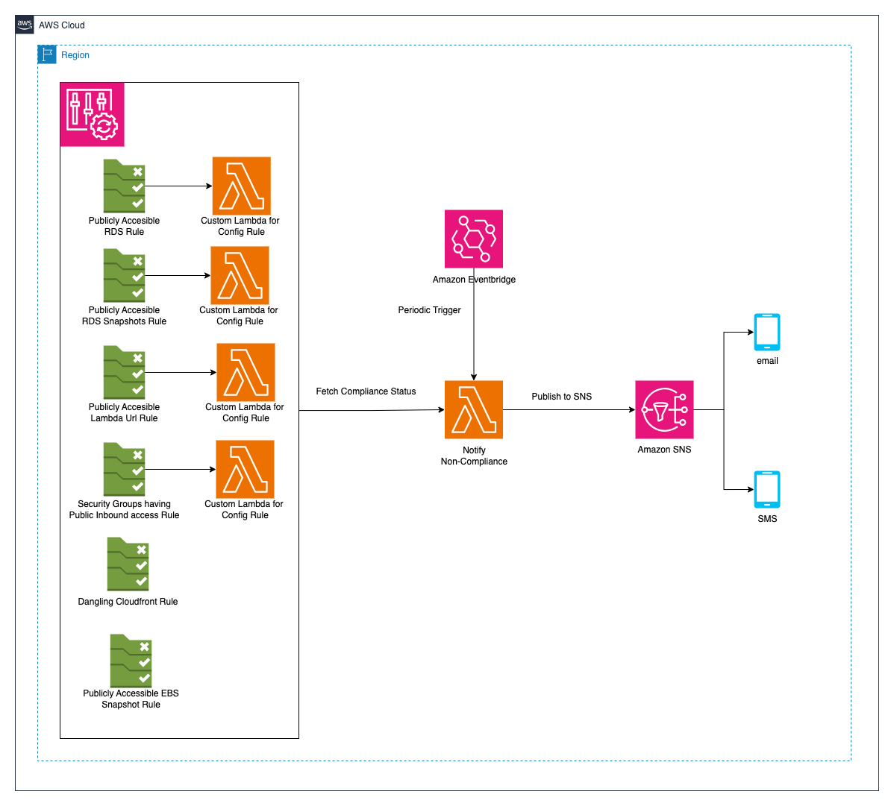

# Vigilert

This project contains a CloudFormation template that is deployed in the user's specific AWS account and region. It performs a series of security checks in your environment. Currently, the template validates the following six checks:

1. Security Group (SG) with inbound rules allowing unrestricted public IPv4 or IPv6 access and is attached to any resource
2. RDS instances with public endpoints
3. CloudFront distributions pointing to non-existent S3 buckets
4. Lambda functions with AuthType set to None
5. RDS public snapshots
6. EBS public snapshots

## Architecture Diagram



## Assumptions

1. You need to deploy the solution in N.Virginia(us-east-1) region.  
2. This solution also needs to be deployed in the regions for which you want to monitor the resources.

## Prerequisites

Before deploying the CloudFormation template, ensure that:

1. You have an active AWS account.
2. AWS Config is enabled in your account/region where you are deploying the solution.
3. You need to deploy the solution in N.Virginia (us-east-1) region. Additionally, you can deploy the solution in the regions where your resources are provisioned.

## Parameters

The CloudFormation template requires the following parameters:

1. **AmazonEmailID**: Your Amazon email ID. This email is used for sending notifications regarding the checks.
2. **EnablePhoneNotificaiton**: If you want to receive non compliance notification on phone, please select `yes` otherwise `no`
3. **PhoneNumber**: If you want to receive non compliance notification on phone, enter your phone number with country code
4. **NotificationFrequency**: Period in which notification will be sent. By default, it is set to 15 minutes(recommended).

## Deployment

You can deploy the CloudFormation template using console or AWS CLI. Follow these steps for deployment through CLI by configuring the right region or you can go in AWS Console and deploy the cloudformation stack:


1. Open Cloudshell Instance in N. Virginia region in your AWS Console.
2. Upload cfn-templates.zip file which can be downloaded from [here](https://gitlab.aws.dev/apj-csc-india-sa/palisade-config-checks/-/tree/main?ref_type=heads).
3. Execute the following commands:
    - `unzip cfn-templates.zip` 
    - `chmod u+x deploy.sh`
    - `./deploy.sh`

You can also go through this [demo](https://broadcast.amazon.com/videos/1022462) which will walk you through the entire deployment process for your reference.

## Delete
1. Open Cloudshell instance in your console on N.Virginia region.
2. Execute the following command and replace `<account-id` with your AWS Account ID and list of regions accordingly
3. ```aws cloudformation delete-stack-instances --stack-set-name palisade-check --accounts <account-id> --regions us-east-1 ap-south-1 --no-retain-stacks```
4. `aws cloudformation delete-stack-set --stack-set-name palisade-check`


## Notifications

After the deployment, you will start receiving notifications to the provided email addresses regarding the status of the checks.

## Support

If you have any issues or questions, feel free to open an issue in this GitLab repository, and we will do our best to resolve it as soon as possible.

## Disclaimer

This template is provided on an "as is" and "as available" basis. The user assumes all risks associated with the use of this template. We are not responsible for any damage or loss related to the use of this template.
